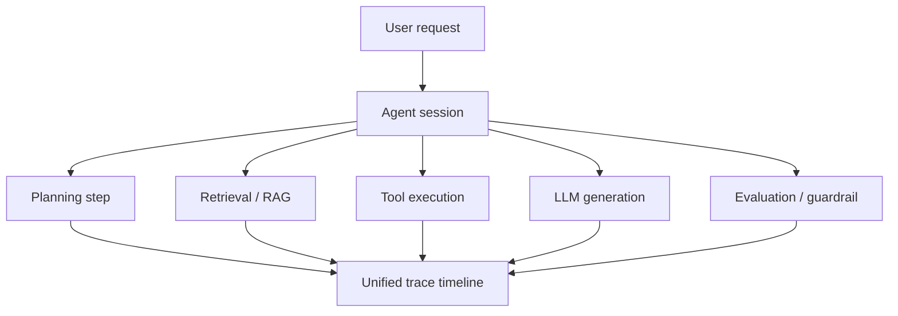

# zradar

[](https://github.com/zvectorlabs/zradar/actions/workflows/ci.yml)
[](LICENSE)

**OpenTelemetry-native observability built specifically for AI agents, LLM applications, and multi-step workflows.**

zradar helps developers understand what their agents are doing, why they fail, how much they cost, and where latency appears. It ingests standard OTLP telemetry and stores high-volume traces, metrics, and logs in a **Parquet-first architecture** built for fast analytical queries at scale—without the massive cost of standard OLTP databases.

---

## ⚡ Why choose zradar?

Traditional APM tools aren't built for non-deterministic LLM chains. Zradar focuses on the specific pain points of modern AI development:

- **AI-Native Context:** Connect agent sessions, LLM generation, tool usage, RAG retrievers, and evaluations in a unified trace timeline.
- **Drastically Lower Costs:** Store massive telemetry volumes cheaply in Parquet while PostgreSQL handles lightweight metadata and control-plane state.
- **Control LLM Spend:** Track prompt tokens, completion tokens, latency, and estimated cost across models, agents, and projects. 
- **No Vendor Lock-In:** Use the OpenTelemetry standards you already know. Send OTLP data directly from your app—no proprietary zradar SDKs required.
- **Local First:** Spin up the stack locally in seconds with Docker. Debug locally with Parquet files before moving to S3-compatible object storage.

---

## 🚀 Quick Start

The fastest way to try zradar is via Docker. Run the server and expose the ingestion (OTLP) and query APIs:

```bash
docker run -d -p 4317:4317 -p 8081:8081 --name zradar ghcr.io/zvectorlabs/zradar:latest
```

- **OTLP gRPC Ingestion:** `localhost:4317` (Send your traces, metrics, and logs here)
- **Admin HTTP API:** `http://localhost:8081` (Query analytics and settings)
- **Swagger / OpenAPI UI:** `http://localhost:8081/swagger-ui/`

*Send sample telemetry from the `examples/` directory (see `examples/README.md`), then query traces via the Swagger UI!*

---

## 🧠 What you can observe

zradar correlates logs, metrics, and traces together into the shape of AI applications.



---

## 📐 Design Principles

zradar is built from the ground up to solve the operational headaches of modern AI systems without introducing new ones. Our core engineering principles are:

- **Cost-Effective Scaling:** Telemetry data is loud and heavy. By storing high-volume logs, metrics, and traces directly in **Parquet** files (on local disk or S3), you bypass the exorbitant storage costs and write bottlenecks of traditional OLTP databases.
- **High Throughput for Any Size:** Whether you are a solo developer hacking on a local agent or an enterprise processing billions of spans, zradar's Rust-based ingestion handles extreme scale with low memory allocation and high concurrency.
- **Zero Vendor Lock-In:** You should own your telemetry. Because zradar speaks standard OpenTelemetry (OTLP), any standard client or SDK can push data to it natively. If you ever want to switch tools, your instrumentation stays exactly the same.
- **Local-First Developer Experience:** Complex telemetry shouldn't require a cloud deployment to test. zradar can run entirely locally with a single container and simple Parquet files, making local debugging and prototyping frictionless.

---

## 🛠️ Development & Contributing

Want to contribute or hack on zradar locally? Here is everything you need to build and run the project efficiently.

### 1. Install Prerequisites

We use standard Rust tooling along with specialized tools for fast, reliable builds:

- **Rust:** `1.93.0` (Use `rustup`)
- **Docker:** Required for spinning up the local PostgreSQL dev/test databases.
- **Python 3:** Required for functional test scripts.
- **just:** A handy command runner. (`cargo install just`)
- **cargo-nextest:** A faster, more reliable test runner. (`cargo install cargo-nextest`)
- **sccache & mold** *(Optional but highly recommended)*: Used for blazing-fast cached builds. 
  - Install via your OS package manager: `sudo apt install mold sccache` or `brew install mold sccache`.

### 2. Local Environment Setup

Spin up the local database and development environment:

```bash
just dev
```

### 3. Build & Test Commands

We use `just` recipes to standardize workflows:

```bash
# See all available commands
just --list

# Format and check code (clippy)
just fmt
just check

# Run unit tests
just test

# Run the full end-to-end Dockerized functional suite
just functional-tests
```

**Fast Builds:** Prefix your commands with `ZRADAR_FAST_BUILD=1` to opt-in to `mold` and `sccache` (e.g., `ZRADAR_FAST_BUILD=1 just test`). This drastically reduces re-compile times.

### 4. Configuration

To configure the server locally, copy `config.toml.example` to `config.toml` and review connection strings, retention windows, and OTLP ports.


