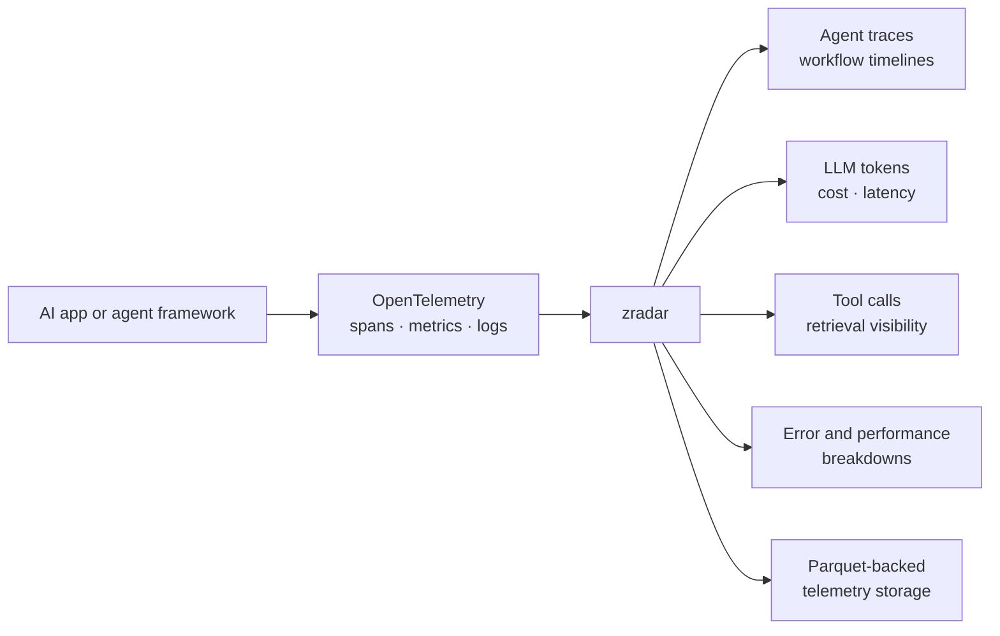
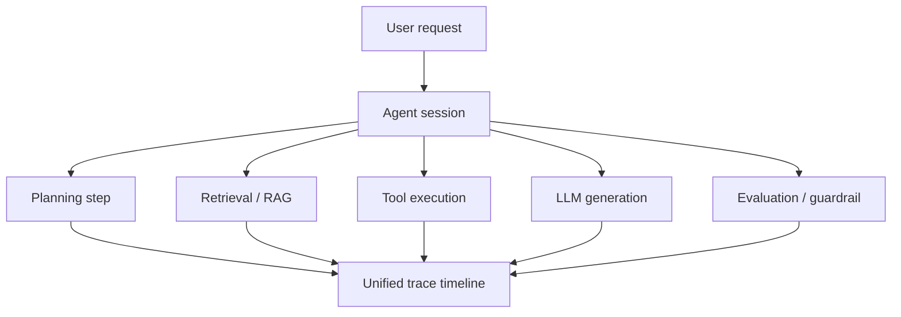
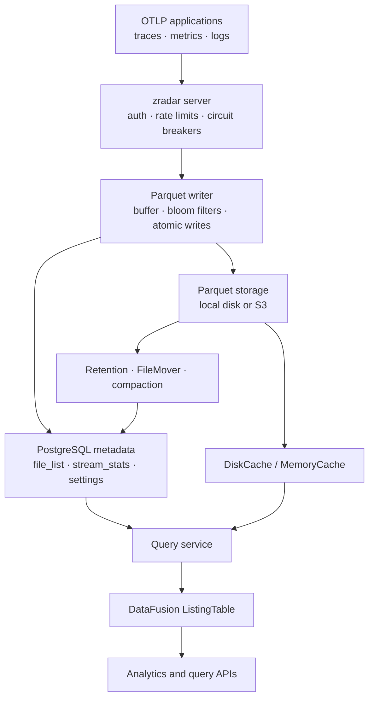

# zradar

**OpenTelemetry-native observability for AI agents, LLM apps, and multi-step workflows.**

zradar helps developers understand what their agents are doing, why they fail, how much they cost, and where latency appears. It ingests standard OTLP telemetry and stores high-volume traces, metrics, and logs in a Parquet-first architecture built for fast analytical queries.



## Why developers try zradar

- **Use standards you already know:** send OpenTelemetry data instead of adopting a proprietary SDK.
- **See full agent execution paths:** connect agent spans, LLM calls, tools, retrievers, chains, and evaluations in one trace model.
- **Debug faster:** inspect latency, errors, status codes, and span metadata across traces, logs, and metrics.
- **Control LLM cost:** track token usage and estimated cost by model, agent, service, and project.
- **Keep telemetry affordable:** store high-volume data in Parquet while PostgreSQL handles metadata and control-plane state.
- **Run locally first:** develop against local PostgreSQL and local Parquet files, then add S3-compatible storage when needed.

## What you can observe

### Agent workflows



zradar is designed for the shape of AI applications, not just traditional request/response services.

### LLM usage and cost

Track model calls, prompt tokens, completion tokens, total tokens, latency, status, and cost signals so you can answer questions like:

- Which agents are most expensive?
- Which models are slowest?
- Where are token spikes coming from?
- Which tools or chains fail most often?

### Logs, metrics, and traces together

zradar supports all three telemetry signals through OTLP ingestion and query APIs, making it easier to correlate behavior across your agent stack.

## Architecture

zradar uses PostgreSQL for metadata and control-plane state, and Parquet for telemetry data.



The Parquet path includes batching, atomic writes, bloom filters, DataFusion `ListingTable` queries, memory/disk caching, retention, and compaction for small-file control.

## Core capabilities

- **OTLP ingestion:** traces, metrics, and logs.
- **Agent-aware span model:** agent, generation, tool, chain, retriever, evaluator, embedding, and guardrail spans.
- **Analytics APIs:** service analytics, top endpoints, error breakdowns, LLM analytics, and agent analytics.
- **Project settings:** per-project ingestion and storage controls.
- **Retention controls:** organization defaults with project overrides.
- **Resilience:** per-project rate limiting, backpressure, health readiness, and circuit breakers.
- **Storage lifecycle:** local Parquet, optional S3 movement, cache layers, and compaction.

## Quick start

Use the repository `make` targets for local development.

```bash
make help
make dev
make health
```

Run checks:

```bash
make fmt
make check
make test
```

Run functional tests:

```bash
make functional_tests_fast
```

## Configuration

Start with `config.toml.example` and tune storage settings for your environment.

Common areas to review:

- PostgreSQL connection
- OTLP ports and API keys
- local Parquet data directory
- S3-compatible storage settings
- retention window
- write buffering and compaction
- circuit breaker thresholds

## Project layout

```text
crates/applications/zradar-server     Server binary
crates/services/api-optel             OTLP ingestion services
crates/services/api                   Query and admin APIs
crates/core/zradar-parquet            Parquet storage and query engine
crates/core/zradar-models             Shared models and config
crates/plugins/zradar-plugin-postgres PostgreSQL repositories
crates/plugins/zradar-plugin-s3       S3 storage plugin
test_functional                       End-to-end scenarios
```

## When zradar is a good fit

Try zradar if you are building:

- AI agents with multi-step execution paths
- LLM applications with token and cost concerns
- RAG systems where retrieval and generation need correlation
- tool-using agents where failures happen across many spans
- observability infrastructure that should stay OpenTelemetry-native
- telemetry systems where Parquet storage is preferable to keeping everything in an OLTP database

## Documentation

- `config.toml.example` for configuration
- `examples/README.md` for instrumentation examples
- `test_functional/README.md` for functional testing
- `AGENTS.md` and `CODING_GUIDELINES.md` for repository contribution guidance

## Status

zradar is under active development. The current architecture is Parquet-first for telemetry with PostgreSQL metadata and control-plane state.
