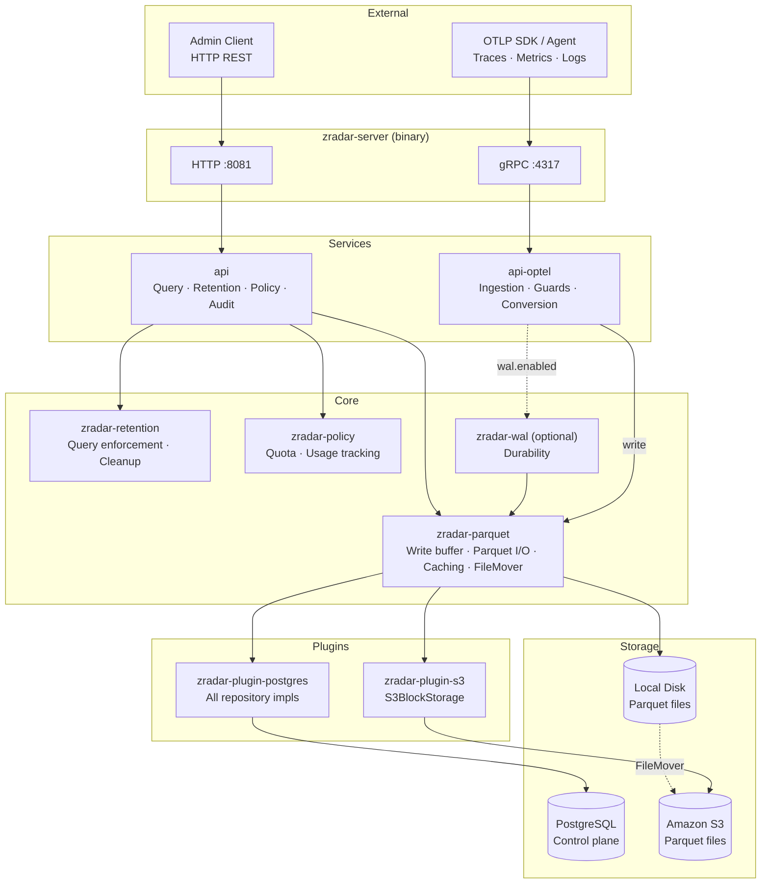
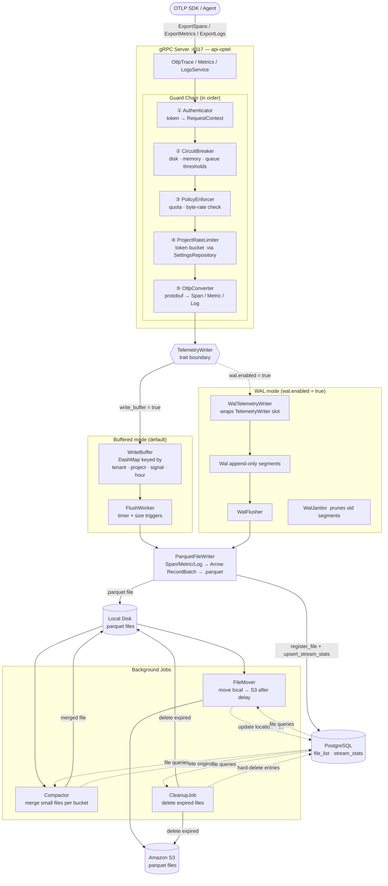
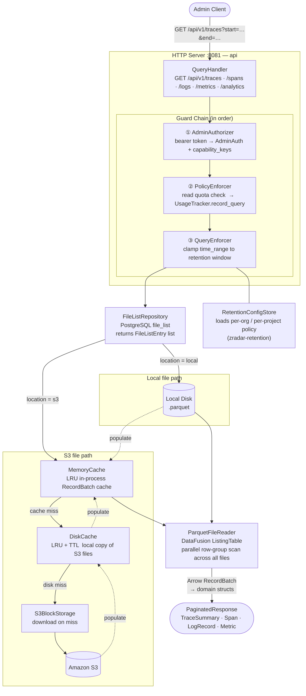
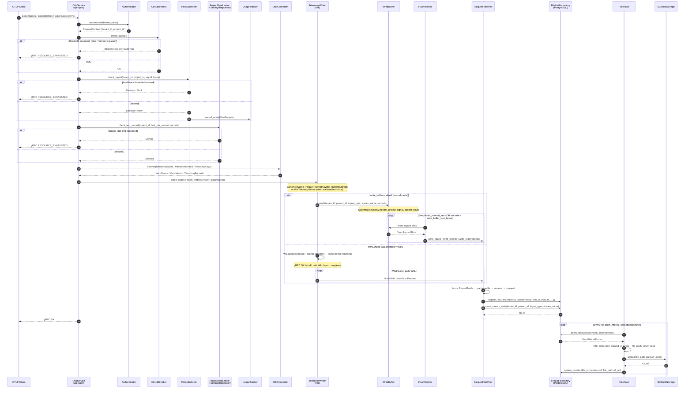
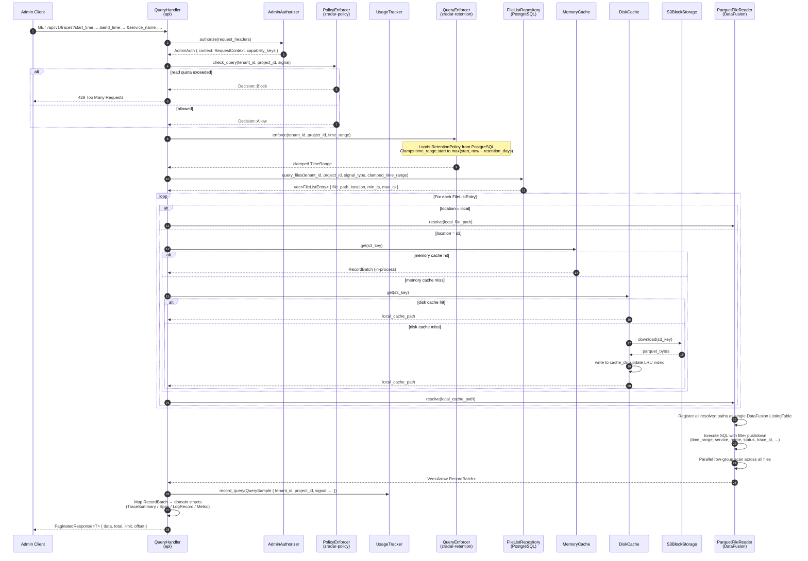

# zradar Architecture Diagrams

Six diagrams covering component structure, write path, read path, and background jobs.

---

## 1. Component Overview

High-level crate layers and primary data-flow edges.

---

## 2. Write Path Architecture

Data flow from OTLP ingestion through the guard chain, write buffer, and on to durable storage.

---

## 3. Read Path Architecture

Data flow from an admin HTTP query through the guard chain, file discovery, cache layers, and DataFusion.

---

## 4. Background Jobs

All background workers, their triggers, and storage interactions.

```mermaid
flowchart TD
    subgraph TRIGGERS["Triggers"]
        TIMER["Timer\n(configurable intervals)"]
        SIZE["Size threshold\n(write_buffer_size_bytes)"]
        STARTUP["Server startup"]
        INTERVAL["Configurable interval\n(storage_snapshot_interval_secs)"]
        POLL["WAL polling"]
    end

    subgraph JOBS["Background Workers"]
        FW["FlushWorker\nDrains WriteBuffer slots to Parquet"]
        FM["FileMover\nMoves local Parquet files to S3"]
        COMP["Compactor\nMerges small files per\ntenant/project/signal/date bucket"]
        CJ["CleanupJob\nDeletes files older than retention_days"]
        SUDJ["StorageUsageDailyJob\nSnapshots compressed bytes per project"]
        WFLUSH["WalFlusher\nDrains WAL records to Parquet"]
        WJAN["WalJanitor\nRemoves old WAL segments"]
        WREP["WalReplayer\nReplays unprocessed WAL on startup"]
        PSR["PolicyStore Refresh\nReloads quota policies every 30s"]
    end

    subgraph READS["Reads From"]
        WB["WriteBuffer\n(in-memory)"]
        WAL_SEG["WAL segments\n(local disk)"]
        LOCAL_FILES["Local .parquet files"]
        S3_FILES["S3 .parquet files"]
        PG_FL["PostgreSQL\nfile_list"]
        PG_POL["PostgreSQL\npolicies table"]
    end

    subgraph WRITES["Writes To"]
        NEW_PAR["New .parquet file\n(local disk)"]
        S3_UPLOAD["S3 bucket"]
        PG_UPD["PostgreSQL\nfile_list updates"]
        PG_USAGE["PostgreSQL\nstorage_cleanup_daily"]
        PG_MERGED["PostgreSQL\nfile_list (merged entry)"]
    end

    TIMER --> FW & FM & COMP & CJ & WJAN & PSR
    SIZE  --> FW
    INTERVAL --> SUDJ
    POLL  --> WFLUSH
    STARTUP --> WREP

    WB --> FW
    FW --> NEW_PAR & PG_UPD

    LOCAL_FILES --> FM
    FM --> S3_UPLOAD & PG_UPD

    PG_FL --> COMP
    LOCAL_FILES --> COMP
    COMP --> NEW_PAR & PG_MERGED

    PG_FL --> CJ
    LOCAL_FILES --> CJ
    S3_FILES --> CJ
    CJ --> PG_UPD

    PG_FL --> SUDJ
    SUDJ --> PG_USAGE

    WAL_SEG --> WFLUSH & WJAN & WREP
    WFLUSH --> NEW_PAR & PG_UPD
    WREP --> NEW_PAR

    PG_POL --> PSR
```

---

## 5. Write Path — Sequence Diagram

Step-by-step call order from OTLP export to durable Parquet file.

---

## 6. Read Path — Sequence Diagram

Step-by-step call order from admin HTTP request to paginated response.

---

## Summary

| Path | Entry | Guard order | Storage |
|------|-------|------------|---------|
| **Write** | gRPC `:4317` | Authenticator → CircuitBreaker → PolicyEnforcer → ProjectRateLimiter | WriteBuffer → FlushWorker → Parquet (local) → S3 |
| **Read** | HTTP `:8081` | AdminAuthorizer → PolicyEnforcer → QueryEnforcer | PostgreSQL file_list → MemoryCache / DiskCache → DataFusion |
| **Background** | Internal timers | — | FileMover, Compactor, CleanupJob, WalFlusher |

**PostgreSQL** holds only metadata (file registry, settings, policies, audit). All telemetry data lives in Parquet files organized as `tenant/project/signal_type/YYYY/MM/DD/HH/*.parquet`.
